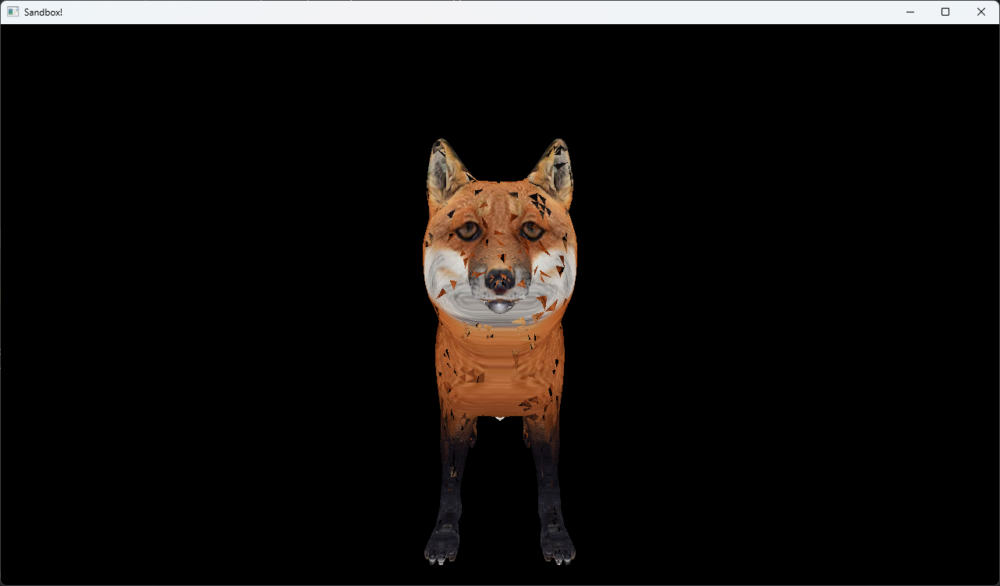

# Java LWJGL 3D Sandbox Project

Этот проект — основа простой 3D-песочницы на Java с использованием LWJGL и ECS архитектуры.  
В текущем виде проект умеет загружать и отображать OBJ модели с текстурами, а также позиционировать объекты в пространстве.

---

## Цели дальнейшей разработки

### 1. Добавление карты (terrain / world)

- Реализовать генерацию или загрузку плоской или сложной карты (terrain) из высотных данных, текстур и мешей.
- Поддержка динамического подгружаемого мира (chunk loading).
- Возможность размещения разных объектов (деревья, дома, персонажи) на карте через сущности.

### 2. Камера и передвижение игрока

- Ввести камеру с управлением.
- Реализовать обработку ввода (клавиатура + мышь) для перемещения камеры в мире.
- Обеспечить корректное обновление матриц view и projection для шейдера.
- Добавить коллизии с объектами карты.

### 3. Управление сущностями и взаимодействия

- Ввести ECS-систему для обработки логики движения, физики, столкновений.
- Добавить компоненты для состояния персонажа: здоровье, скорость, состояние анимации.
- Позволить взаимодействовать с объектами мира: собирать, открывать, изменять.

### 4. Загрузка ресурсов и ассетов

- Сделать асинхронную загрузку моделей и текстур в отдельном потоке.
- Добавить поддержку форматов FBX, glTF.

### 5. UI и взаимодействие с пользователем

- Создать простое меню, HUD для отображения состояния игрока.
- Добавить поддержку ввода через мышь и клавиатуру.
- Реализовать вывод информации об объекте при наведении.

---

## Ресурсы и ссылки

- [LWJGL 3 Documentation](https://www.lwjgl.org/guide)
- [JOML Library](https://github.com/JOML-CI/JOML)
- [LearnOpenGL — GLSL shaders и математика](https://learnopengl.com/)
- Примеры ECS архитектур на Java (например, Ashley, Artemis)

---

## Заключение

Этот проект — гибкая база для создания простой 3D песочницы с использованием Java и OpenGL.  

---

